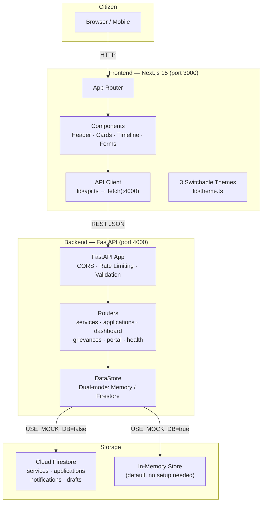
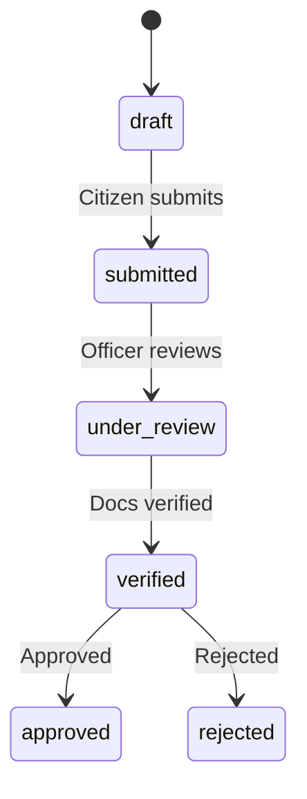

# Vsrun-Mayya / Citizen Services Portal

A **separate frontend + backend** citizen services platform built from [Stitch/Figma screens](stitch_citizen_services_portal/) and the [Public Service Hackathon playbook](public_service_hackathon_playbook.md).

Government-grade trust and structure — faster, cleaner, and architected to scale.

## Architecture



| Layer | Tech | Port | Role |
|-------|------|------|------|
| **Frontend** | Next.js 15, React 19, Tailwind CSS, Lucide Icons, Framer Motion | 3000 | Citizen UI — home, services, apply, track, dashboard, grievance |
| **Backend** | FastAPI (Python), Pydantic, Firebase Admin SDK | 4000 | REST API — validation, rate limiting (300 req/min), data access |
| **Database** | Firebase Firestore (or in-memory fallback) | — | 4 collections: services, applications, notifications, drafts |
| **Shared** | TypeScript types (`shared/types.ts`) | — | Type contract between frontend & backend |

### Application Status Flow



### Key Endpoints

| Method | Endpoint | Purpose |
|--------|----------|---------|
| `GET` | `/api/services` | List/filter services |
| `POST` | `/api/applications` | Submit application |
| `GET` | `/api/applications/track/:id` | Track by reference ID |
| `GET` | `/api/dashboard` | Citizen dashboard |
| `POST` | `/api/grievances` | File grievance |
| `GET` | `/api/portal/*` | Portal content (10 endpoints) |

See **[docs/ARCHITECTURE.md](docs/ARCHITECTURE.md)** for full diagrams, API reference, and scaling notes. See **[docs/TESTING_GUIDE.md](docs/TESTING_GUIDE.md)** for testing procedures.

## Quick start

```bash
# Install dependencies (frontend + Python backend)
npm run install:all

# Run both frontend and backend
npm run dev
```

- **Frontend:** http://localhost:3000  
- **Backend API:** http://localhost:4000  
- **API Docs (Swagger):** http://localhost:4000/docs  

Works out of the box with **in-memory storage**. Connect Firebase for persistent data (see Architecture doc).

## Project structure

```
frontend/          Next.js UI — Stitch design system (Home, Services, Dashboard, Apply, Track)
backend/           FastAPI REST API — Firebase Admin, rate limiting, Pydantic validation
firebase/          Firestore rules & indexes
shared/            TypeScript types (frontend reference)
docs/              Architecture & deployment guides
stitch_citizen_services_portal/   Original Figma/Stitch HTML exports (design reference)
```

## Backend (FastAPI)

```bash
cd backend
pip install -r requirements.txt
python -m uvicorn app.main:app --reload --port 4000
```

## Demo credentials

| Item | Value |
|------|-------|
| OTP | `123456` |
| Track IDs | `RES-2026-8842`, `VEH-2026-1190`, `INC-2026-0001` |

## Firebase setup (optional)

```bash
cd backend
cp .env.example .env
# Set USE_MOCK_DB=false and add service account key
python -m scripts.seed
```

---

**Prototype / Demo — Not an official Government platform**
