# Citizen Services Portal — Complete Architecture

## Table of Contents

1. [System Overview](#system-overview)
2. [High-Level Architecture](#high-level-architecture)
3. [Frontend Architecture](#frontend-architecture)
4. [Backend Architecture](#backend-architecture)
5. [Database & Firestore](#database--firestore)
6. [API Reference](#api-reference)
7. [Authentication & Security](#authentication--security)
8. [Data Flow Diagrams](#data-flow-diagrams)
9. [Deployment Architecture](#deployment-architecture)

---

## System Overview

A monorepo citizen services portal built for the Public Service Hackathon. It provides a citizen-facing UI to browse government services, submit applications, track status, and file grievances.

| Layer | Technology | Port | Purpose |
|-------|-----------|------|---------|
| Frontend | Next.js 15 + React 19 + Tailwind CSS | 3000 | Citizen-facing UI |
| Backend | FastAPI (Python 3.11+) | 4000 | REST API + business logic |
| Database | Firebase Firestore | — | Persistent storage (or in-memory fallback) |
| Shared | TypeScript types | — | Type contract between frontend/backend |

---

## High-Level Architecture

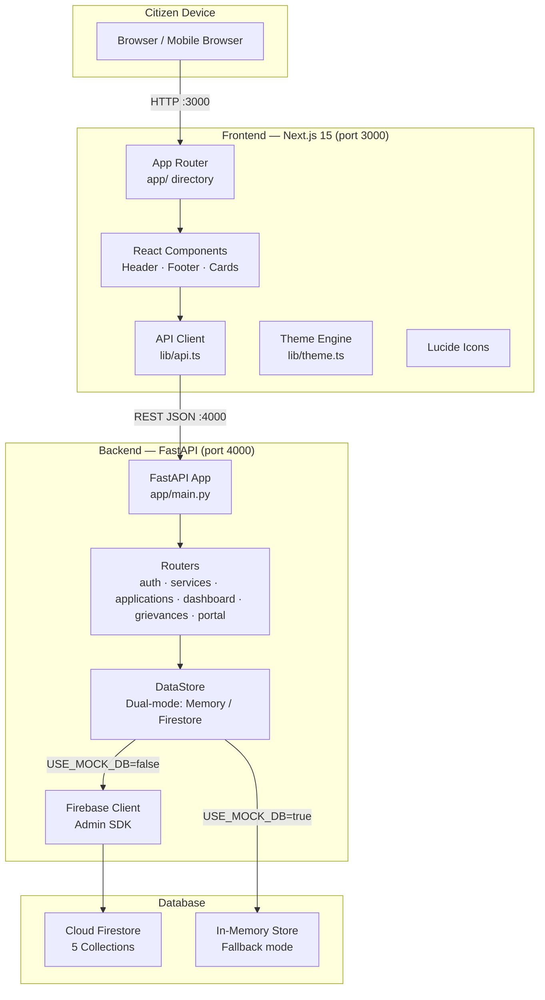

---

## Frontend Architecture

### Directory Structure

```
frontend/
├── app/                      # Next.js App Router pages
│   ├── layout.tsx            # Root layout (Outfit font, Lenis scroll)
│   ├── globals.css           # Tailwind + custom CSS
│   ├── page.tsx              # Home page
│   ├── not-found.tsx         # 404 page
│   ├── api/status/route.ts   # Mock API route (status)
│   ├── services/             # Service catalog
│   ├── apply/                # Application wizard
│   │   ├── page.tsx          # Generic apply form
│   │   └── [slug]/page.tsx   # Service-specific apply
│   ├── track/                # Track by reference ID
│   ├── dashboard/            # Citizen dashboard
│   ├── status/               # View all applications
│   ├── grievance/            # File grievance
│   ├── helpline/             # Emergency numbers
│   ├── help/                 # Help & FAQ
│   ├── departments/          # Department directory
│   ├── policies/             # Government policies
│   ├── privacy/              # Privacy policy
│   └── terms/                # Terms of service
├── components/               # Reusable UI components
│   ├── Header.tsx            # Glassmorphism sticky header
│   ├── Footer.tsx            # 4-column footer
│   ├── Icon.tsx              # Lucide icon wrapper
│   ├── Breadcrumbs.tsx       # Navigation breadcrumbs
│   ├── ServiceCard.tsx       # Service listing card
│   ├── ApplicationTimeline.tsx
│   ├── GrievanceForm.tsx
│   ├── CookieConsent.tsx
│   ├── PrototypeBanner.tsx
│   ├── DirectoryNavClient.tsx
│   ├── InfoPageLayout.tsx
│   ├── PortalChrome.tsx
│   ├── MotionWrappers.tsx    # Framer Motion animations
│   └── SmoothScrollProvider.tsx  # Lenis smooth scroll
├── lib/                      # Utilities & API layer
│   ├── api.ts                # Core API client (apiFetch)
│   ├── types.ts              # TypeScript interfaces
│   ├── portal-api.ts         # Portal-specific API calls
│   ├── theme.ts              # 3 switchable themes
│   ├── fonts.ts              # Outfit font config
│   ├── images.ts             # Curated Unsplash images
│   ├── dummydata.ts          # Frontend-only demo data
│   └── mock-data.ts          # Mock data for /api/status
├── public/
│   ├── logo.svg              # SVG logo (government building)
│   └── fonts/Outfit-Variable.woff2
├── tailwind.config.ts        # Theme-driven Tailwind config
├── next.config.js            # Turbopack root fix
└── package.json
```

### Component Flow

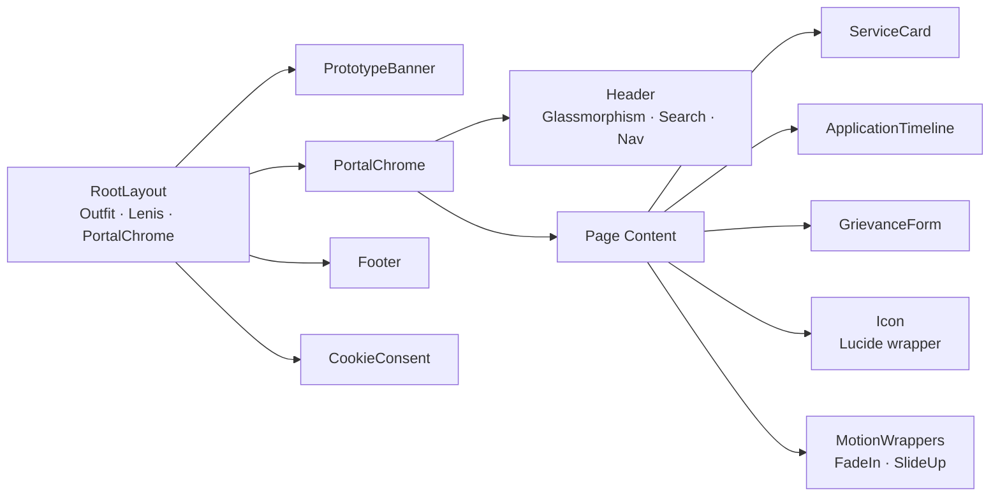

### Theme System

Three themes are defined in `lib/theme.ts`. Only one is active at a time (comment/uncomment to switch). The Tailwind config imports the active theme's colors, so all utility classes (`text-secondary`, `bg-gov-red`, etc.) update automatically.

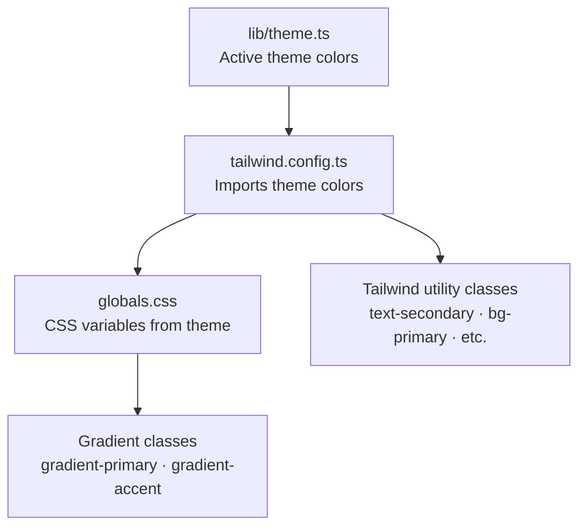

| Theme | Primary | Accent | Style |
|-------|---------|--------|-------|
| Original | `#1f2937` | `#3b82f6` | Blue/Gray Corporate |
| Energetic Minimalism | `#3D3D3D` | `#FF4081` | Soft Neons & Bold Pops |
| **Soft Citrus (active)** | `#4A4A4A` | `#FF6D00` | Warm & Confident |

---

## Backend Architecture

### Directory Structure

```
backend/
├── app/
│   ├── main.py               # FastAPI app factory, middleware, exception handlers
│   ├── config.py             # Pydantic Settings (env-based)
│   ├── models.py             # All Pydantic schemas
│   ├── data/
│   │   ├── catalog.py        # 12 services, seed data, timeline builder
│   │   └── portal_content.py # Static portal content (FAQs, helplines, etc.)
│   ├── routers/
│   │   ├── services.py       # GET /api/services, GET /api/services/:slug
│   │   ├── applications.py   # GET/POST /api/applications
│   │   ├── dashboard.py      # GET /api/dashboard
│   │   ├── grievances.py     # POST/GET /api/grievances
│   │   ├── portal.py         # 10 portal content endpoints
│   │   └── health.py         # GET /api/health
│   └── services/
│       ├── data_store.py     # Dual-mode: Memory or Firestore
│       ├── firebase_client.py # Firebase Admin SDK init
│       └── grievances.py     # In-memory grievance store
├── scripts/
│   └── seed.py               # CLI Firestore seeder
├── requirements.txt
└── .env.example
```

### Startup Flow

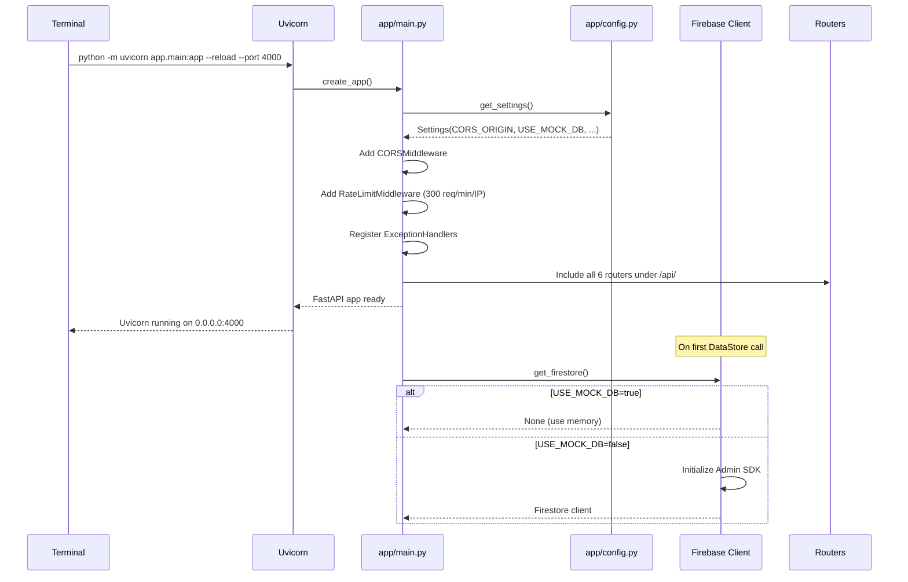

### Request Lifecycle

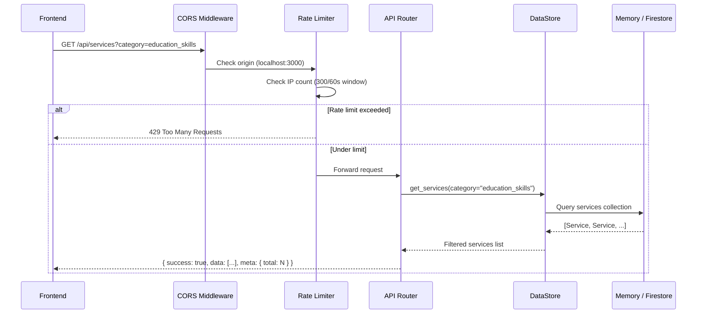

### Rate Limiting

- **Algorithm:** Sliding window counter per IP
- **Limit:** 300 requests per 60-second window
- **Storage:** In-memory dictionary (resets on server restart)
- **Response:** `429 Too Many Requests` with `{"success": false, "error": "Too many requests..."}`

---

## Database & Firestore

### Collections Schema

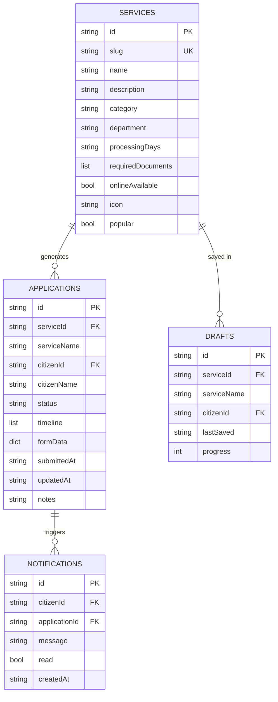

### Application Status Flow

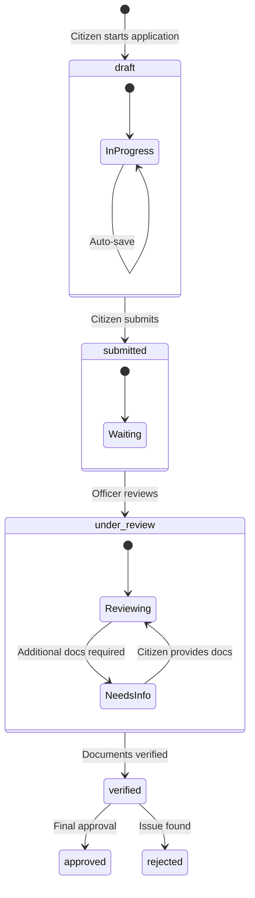

### Firestore Security Rules

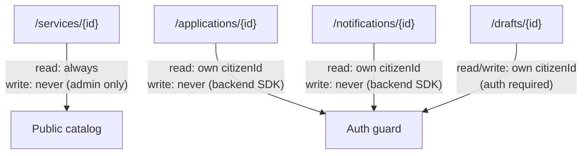

### Composite Indexes

| Collection | Fields | Purpose |
|-----------|--------|---------|
| `applications` | `citizenId ASC, updatedAt DESC` | Dashboard: citizen's apps sorted by recent |
| `notifications` | `citizenId ASC, createdAt DESC` | Dashboard: citizen's notifications sorted by recent |

### Dual-Mode Storage

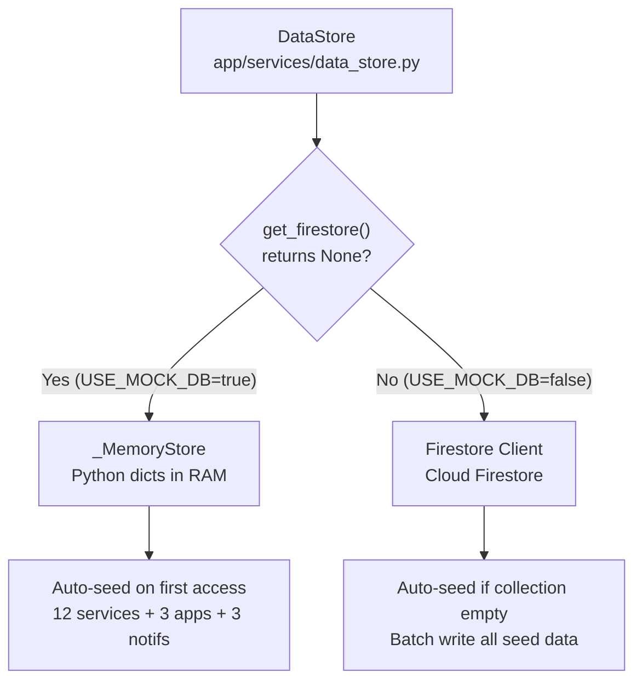

---

## API Reference

### Base URL: `http://localhost:4000`

### Standard Response Envelope

```json
{
  "success": true,
  "data": "<T>",
  "error": null,
  "meta": { "total": 12 }
}
```

### Endpoint Map

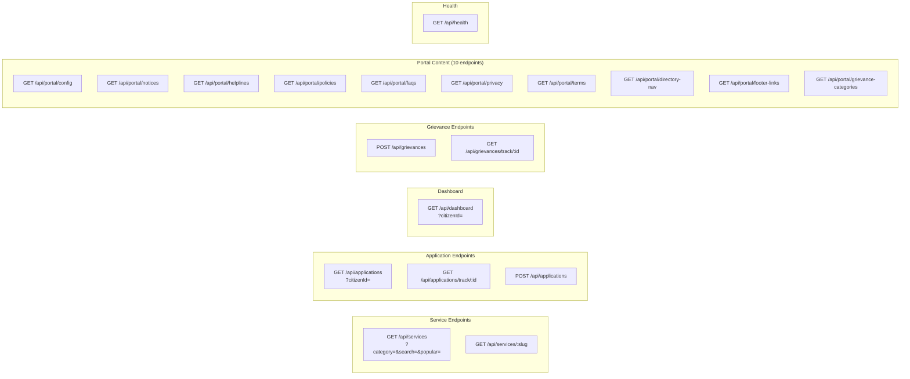

### Detailed Endpoints

| Method | Path | Query Params | Request Body | Response |
|--------|------|-------------|--------------|----------|
| `GET` | `/` | — | — | Server info + docs URL |
| `GET` | `/api/health` | — | — | `{ status, timestamp, storage, environment, version }` |
| `POST` | `/api/auth/register` | — | `RegisterUserPayload` | `Citizen` (201) |
| `GET` | `/api/services` | `category?`, `search?`, `onlineOnly?`, `popular?` | — | `Service[]` + `meta.total` |
| `GET` | `/api/services/:slug` | — | — | `Service` |
| `GET` | `/api/applications` | `citizenId?` | — | `Application[]` + `meta.total` |
| `GET` | `/api/applications/track/:id` | — | — | `Application` |
| `POST` | `/api/applications` | — | `CreateApplicationPayload` | `Application` (201) |
| `GET` | `/api/dashboard` | `citizenId?` | — | `DashboardData` |
| `POST` | `/api/grievances` | — | `GrievancePayload` | `GrievanceRecord` (201) |
| `GET` | `/api/grievances/track/:id` | — | — | `GrievanceRecord` |
| `GET` | `/api/portal/config` | — | — | Portal config object |
| `GET` | `/api/portal/notices` | — | — | `Notice[]` |
| `GET` | `/api/portal/helplines` | — | — | `{ emergency: [], other: [] }` |
| `GET` | `/api/portal/policies` | — | — | `Policy[]` |
| `GET` | `/api/portal/faqs` | — | — | `Faq[]` |

---

## Authentication & Security

### Current State

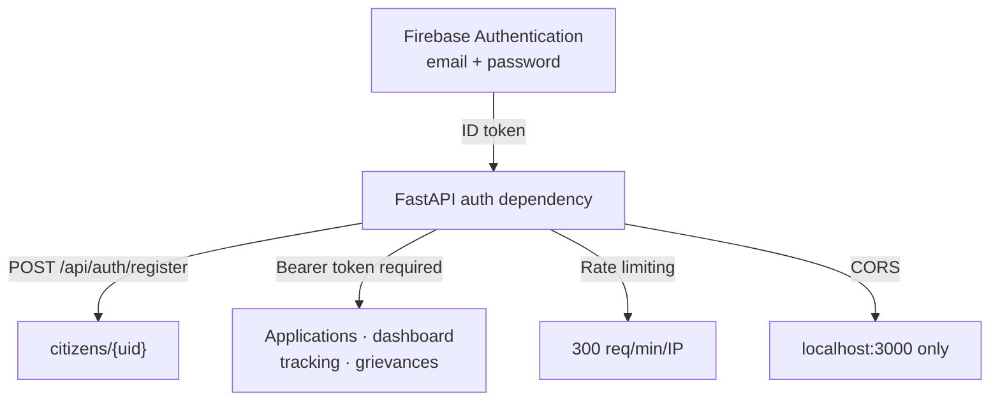

| Layer | Protection | Notes |
|-------|-----------|-------|
| CORS | Origin whitelist | `http://localhost:3000` |
| Authentication | Firebase ID token | Backend verifies the token and registers the citizen by Firebase UID |
| Rate Limiting | 300 req/min per IP | In-memory, resets on restart |
| Input Validation | Pydantic models | Auto-validated by FastAPI |
| Firestore Rules | citizenId ownership | Client reads own data only |
| Backend Writes | Admin SDK only | All writes go through API |

### Remaining Production Security Requirements

- [x] Firebase Authentication (email/password)
- [x] JWT token validation middleware
- [ ] Environment-based CORS (not hardcoded)
- [ ] HTTPS enforcement
- [ ] Secrets in environment variables only
- [ ] Firestore rules enforce auth.uid matching

---

## Data Flow Diagrams

### Application Submission Flow

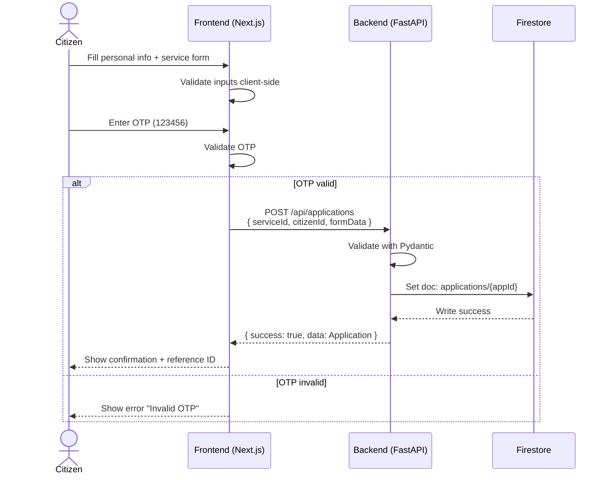

### Service Catalog Load Flow

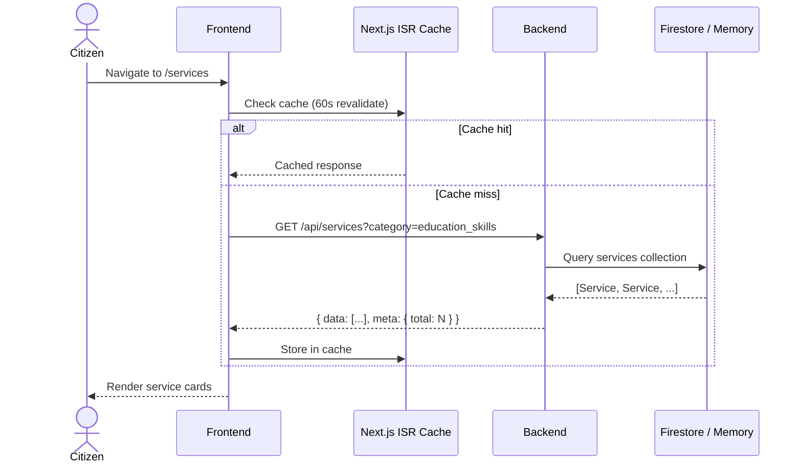

### Grievance Submission Flow

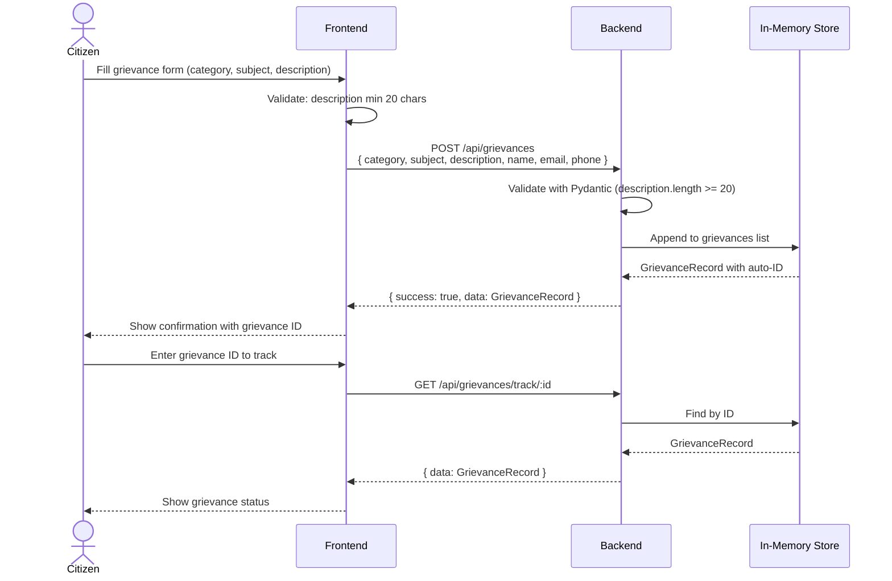

### Dashboard Load Flow

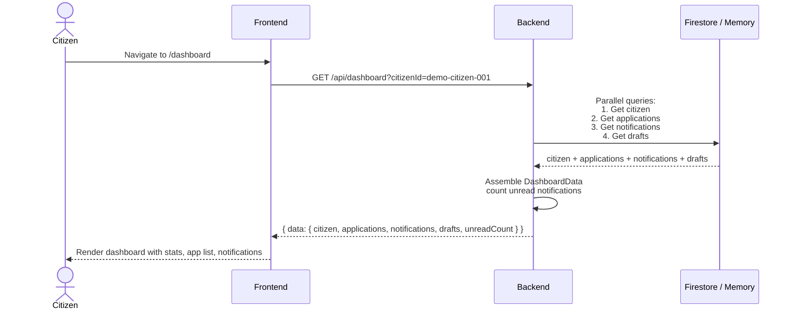

---

## Deployment Architecture

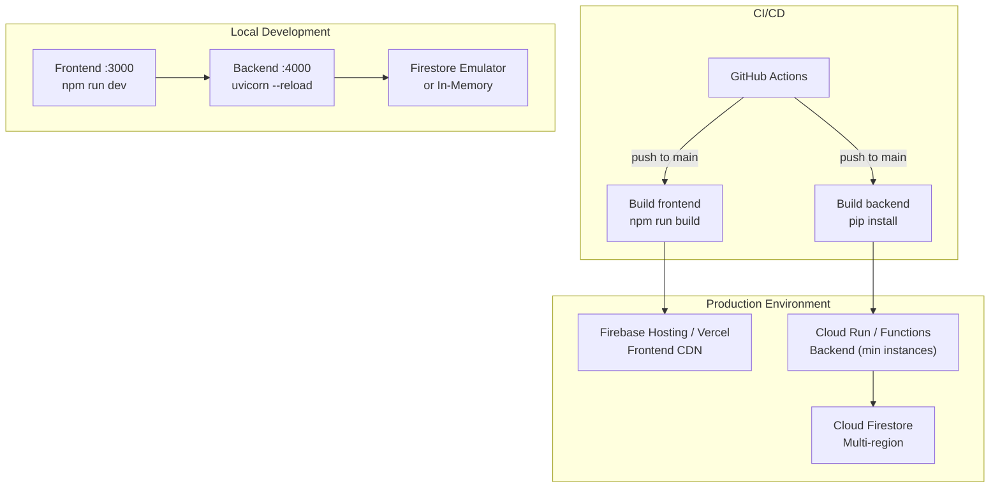

### Ports

| Service | Local | Production |
|---------|-------|-----------|
| Frontend | `localhost:3000` | CDN domain |
| Backend API | `localhost:4000` | Cloud Run URL |
| Firestore | Emulator or memory | Google-managed |
| API Docs | `localhost:4000/docs` | Internal only |

### Startup Commands

```bash
# Start both frontend + backend
npm run dev

# Start individually
npm run dev:frontend    # Next.js on :3000
npm run dev:backend     # FastAPI on :4000

# Seed Firestore
npm run seed

# Build for production
npm run build
```

---

## Demo Credentials

| Item | Value |
|------|-------|
| Citizen ID | `demo-citizen-001` |
| OTP | `123456` |
| Track IDs | `RES-2026-8842`, `VEH-2026-1190`, `INC-2026-0001` |
| Services in catalog | 12 |
| Categories | 4 (identity_civil, education_skills, health_welfare, business_trade) |

---

## Compliance

- All PII is synthetic (`@example.com`, `demo-citizen-001`)
- Visible prototype disclaimer banner on every page
- No calls to live `.gov.in` endpoints
- OTP is hardcoded demo value: `123456`
- Rate limiting prevents abuse
- No production secrets committed
