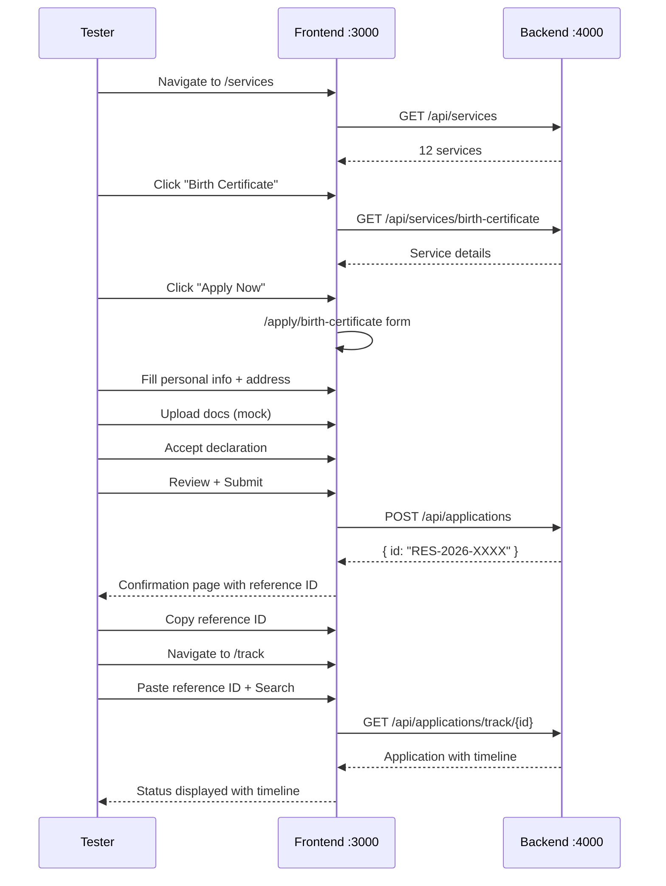

# Citizen Services Portal — Testing Guide

## Table of Contents

1. [Prerequisites](#prerequisites)
2. [Environment Setup](#environment-setup)
3. [Backend API Testing](#backend-api-testing)
4. [Frontend Manual Testing](#frontend-manual-testing)
5. [End-to-End Flow Testing](#end-to-end-flow-testing)
6. [Mobile & Accessibility Testing](#mobile--accessibility-testing)
7. [Performance Testing](#performance-testing)
8. [Troubleshooting](#troubleshooting)

---

## Prerequisites

| Tool | Version | Purpose |
|------|---------|---------|
| Node.js | 18+ | Frontend runtime |
| Python | 3.11+ | Backend runtime |
| pip | Latest | Python package manager |
| npm | 9+ | Node package manager |
| Browser | Chrome/Firefox/Safari | Manual testing |

---

## Environment Setup

### 1. Install all dependencies

```bash
# From project root
npm run install:all
```

This runs:
- `npm install --prefix frontend` (Node deps)
- `pip install -r backend/requirements.txt` (Python deps)

### 2. Configure environment

```bash
# Backend
cp backend/.env.example backend/.env
# Default: USE_MOCK_DB=true (in-memory, no Firebase needed)

# Frontend
cp frontend/.env.local.example frontend/.env.local 2>/dev/null || echo 'NEXT_PUBLIC_API_URL=http://localhost:4000' > frontend/.env.local
```

### 3. Start development servers

```bash
# Both frontend + backend
npm run dev

# Or separately:
npm run dev:frontend   # http://localhost:3000
npm run dev:backend    # http://localhost:4000
```

---

## Backend API Testing

### Health Check

```bash
curl http://localhost:4000/api/health
```

Expected response:
```json
{
  "success": true,
  "data": {
    "status": "healthy",
    "timestamp": "2026-08-26T...",
    "storage": "memory",
    "environment": "development",
    "version": "1.0.0"
  }
}
```

### Demo Auth Token

Protected endpoints require a `Authorization: Bearer <token>` header. Without Firebase credentials the backend runs a **demo bypass**: any non-JWT token is accepted as an identity (e.g. `demo-user`). Use it for all protected calls below.

```bash
curl -H "Authorization: Bearer demo-user" http://localhost:4000/api/dashboard
```

### Test All Endpoints

```bash
# 1. Root info
curl http://localhost:4000/

# 2. Health
curl http://localhost:4000/api/health

# 3. List all services
curl http://localhost:4000/api/services

# 4. Filter services by category
curl "http://localhost:4000/api/services?category=education_skills"

# 5. Search services
curl "http://localhost:4000/api/services?search=certificate"

# 6. Get popular services
curl "http://localhost:4000/api/services?popular=true"

# 7. Get single service by slug
curl http://localhost:4000/api/services/birth-certificate

# 8. List applications (protected)
curl -H "Authorization: Bearer demo-user" http://localhost:4000/api/applications

# 9. Track application by ID (protected)
curl -H "Authorization: Bearer demo-user" http://localhost:4000/api/applications/track/RES-2026-8842

# 10. Submit new application (protected)
curl -X POST http://localhost:4000/api/applications \
  -H "Content-Type: application/json" \
  -H "Authorization: Bearer demo-user" \
  -d '{
    "serviceId": "svc-birth-cert",
    "citizenId": "demo-citizen-001",
    "citizenName": "Demo Citizen",
    "formData": {"name": "Test User", "dob": "2000-01-01"}
  }'

# 11. Dashboard (protected)
curl -H "Authorization: Bearer demo-user" http://localhost:4000/api/dashboard

# 12. Submit grievance (protected)
curl -X POST http://localhost:4000/api/grievances \
  -H "Content-Type: application/json" \
  -H "Authorization: Bearer demo-user" \
  -d '{
    "category": "service-delay",
    "subject": "Slow processing",
    "description": "My application has been pending for over 2 weeks and there has been no update on the portal.",
    "name": "Test User",
    "email": "test@example.com",
    "phone": "+91 98765 43210"
  }'

# 13. Track grievance (use ID from step 12; protected)
curl -H "Authorization: Bearer demo-user" http://localhost:4000/api/grievances/track/GRIEV-001

# 14. Portal content endpoints
curl http://localhost:4000/api/portal/config
curl http://localhost:4000/api/portal/notices
curl http://localhost:4000/api/portal/helplines
curl http://localhost:4000/api/portal/policies
curl http://localhost:4000/api/portal/faqs
curl http://localhost:4000/api/portal/privacy
curl http://localhost:4000/api/portal/terms
curl http://localhost:4000/api/portal/directory-nav
curl http://localhost:4000/api/portal/footer-links
curl http://localhost:4000/api/portal/grievance-categories

# 15. Register / upsert demo citizen (protected)
curl -X POST http://localhost:4000/api/auth/register \
  -H "Content-Type: application/json" \
  -H "Authorization: Bearer demo-user" \
  -d '{"name":"Demo Citizen","phone":"+91 00000 00000"}'
```

### Chat Assistant Tests (`/api/chat`)

```bash
# 1. Service lookup (top-k service match + deep link)
curl -X POST http://localhost:4000/api/chat \
  -H "Content-Type: application/json" \
  -d '{"message":"How do I get an income certificate?"}'

# 2. Helplines
curl -X POST http://localhost:4000/api/chat \
  -H "Content-Type: application/json" \
  -d '{"message":"Emergency helplines"}'

# 3. Application tracking
curl -X POST http://localhost:4000/api/chat \
  -H "Content-Type: application/json" \
  -d '{"message":"How to track my application?"}'

# 4. Grievance guidance
curl -X POST http://localhost:4000/api/chat \
  -H "Content-Type: application/json" \
  -d '{"message":"How do I file a grievance?"}'

# 5. Greeting
curl -X POST http://localhost:4000/api/chat \
  -H "Content-Type: application/json" \
  -d '{"message":"hi"}'

# 6. No-match fallback (still returns links)
curl -X POST http://localhost:4000/api/chat \
  -H "Content-Type: application/json" \
  -d '{"message":"xyzzy qwerty"}'

# 7. Validation: empty / too-long message → 400
curl -X POST http://localhost:4000/api/chat \
  -H "Content-Type: application/json" \
  -d '{"message":""}'
```

Expected responses: `success: true`, `data.answer`, `data.intent` (`service`/`helpline`/`track`/`grievance`/`greeting`/`faq`/`fallback`), optional `data.links[]` with `label` + `href`. Empty message body → `400` validation error.

### Interactive API Docs (Swagger UI)

The backend ships **Swagger UI** (interactive, try-it-in-browser) and **ReDoc** (read-only). No UI of the portal itself is needed — everything lives at one URL.

- Swagger UI (interactive): http://localhost:4000/docs
- ReDoc (documentation only): http://localhost:4000/redoc

#### How to use Swagger UI

1. Start the backend, then open http://localhost:4000/docs.
2. Endpoints are grouped by **tag** (bars on the right): `health`, `auth`, `services`, `applications`, `dashboard`, `grievances`, `portal`, `chat`.
3. Click any endpoint to expand it, then **Try it out** (top-right of that block).
4. Fill in the parameters/body, then **Execute**. The response (status code, headers, JSON body) appears below.
5. For any non-`GET` endpoint, Swagger pre-fills a sample JSON body — edit and Execute.

#### Authenticating protected endpoints in Swagger

`/api/applications`, `/api/dashboard`, `/api/grievances`, and `/api/auth/register` require auth. This app reads auth from an **`Authorization` header parameter** (there is **no Authorize button**). For each protected endpoint:

1. After clicking **Try it out**, find the **`authorization`** header field.
2. Enter: `Bearer demo-user`
3. Execute → returns `200` (demo bypass; no Firebase needed).

> The chat endpoint `/api/chat` and all `services` / `portal` / `health` endpoints are **public** — leave the authorization field empty.

#### Guided walkthrough (endpoint → what to send → expected status)

| # | Endpoint | Set / send | Expect |
|---|---|---|---|
| 1 | `GET /api/health` | nothing | `200` `data.status: "healthy"` |
| 2 | `GET /api/services` | nothing | `200` list of 12 services |
| 3 | `GET /api/services/{slug}` | path: `birth-certificate` | `200` single service |
| 4 | `POST /api/chat` | body: `{"message":"Emergency helplines"}` | `200` `intent: "helpline"` + numbers |
| 5 | `GET /api/applications` | auth header: `Bearer demo-user` | `200` list of applications |
| 6 | `POST /api/applications` | auth header + body below | `201` created app with reference ID |
| 7 | `GET /api/dashboard` | auth header: `Bearer demo-user` | `200` citizen + apps + notifications |
| 8 | `POST /api/auth/register` | auth header + body: `{"name":"Demo Citizen","phone":""}` | `201` citizen |
| 9 | `POST /api/grievances` | auth header + body below | `201` grievance with ID |
| 10 | `GET /api/grievances/track/{grievance_id}` | auth header + ID from step 9 | `200` grievance record |
| 11 | `POST /api/chat` | body: `{"message":""}` | `400` validation error |
| 12 | `GET /api/applications` | no header | `401` "Sign in is required" |

Sample bodies for Swagger:

```json
// POST /api/applications
{
  "serviceId": "svc-birth-cert",
  "citizenId": "demo-citizen-001",
  "citizenName": "Demo Citizen",
  "formData": { "name": "Test User", "dob": "2000-01-01" },
  "saveAsDraft": false
}

// POST /api/grievances
{
  "category": "service-delay",
  "subject": "Slow processing",
  "description": "My application has been pending for over 2 weeks and there has been no update on the portal.",
  "name": "",
  "email": "",
  "phone": ""
}
```

#### Reading a response

- `success: true` → call succeeded; real payload is under `data`.
- `success: false` → failure; reason is under `error`.
- Status codes you may see: `200` OK, `201` created, `400` validation, `401` unauthenticated, `404` not found, `429` rate-limited.
- To copy the exact `curl` for any request, click the red **Request URL / curl** line under the endpoint after `Execute` — great for reproducing a test without the browser.

#### Swagger extras

- The top search bar filters endpoints by name (e.g. type `chat`, `grievance`).
- `POST /api/chat` — note the `ChatMessage` schema shows `message` (required, 1–500 chars) and optional `history`.
- Expand any schema name (`ChatReply`, `Service`, `Application`, `GrievanceRecord`) to see its fields and defaults.

---

### Complete Request-Body Reference (every route)

Every route the server exposes, with what to fill in Swagger (`authorization` header, path/query params, or JSON body) and the expected status. 🔒 = set `authorization` header to `Bearer demo-user`.

#### Public GET routes (no body)

| Method | Route | Query parameters (optional) | Expect |
|---|---|---|---|
| `GET` | `/` | — | `200` API info object |
| `GET` | `/api/health` | — | `200` healthy |
| `GET` | `/api/services` | `category` = `identity_civil` · `education_skills` · `health_welfare` · `business_trade` · `housing_land`<br/>`onlineOnly` = `true`/`false` · `search` = any word · `popular` = `true`/`false` | `200` list of services |
| `GET` | `/api/portal/config` | — | `200` portal config |
| `GET` | `/api/portal/notices` | — | `200` notices |
| `GET` | `/api/portal/directory-nav` | — | `200` nav links |
| `GET` | `/api/portal/footer-links` | — | `200` footer links |
| `GET` | `/api/portal/helplines` | — | `200` helplines |
| `GET` | `/api/portal/policies` | — | `200` policies |
| `GET` | `/api/portal/faqs` | — | `200` FAQs |
| `GET` | `/api/portal/privacy` | — | `200` privacy sections |
| `GET` | `/api/portal/terms` | — | `200` terms sections |
| `GET` | `/api/portal/grievance-categories` | — | `200` categories |

#### Path-parameter GET routes

| Method | Route | Path parameter | Expect |
|---|---|---|---|
| `GET` | `/api/services/{slug}` | `birth-certificate` · `income-certificate` · `pension-scheme` · `domicile-certificate` · `driving-license` · `scholarships` · `legal-heir` · `police-clearance` · `national-id-renewal` · `business-license` · `health-insurance` · `university-scholarship` | `200` service / `404` |
| 🔒 `GET` | `/api/applications` | — | `200` list of applications |
| 🔒 `GET` | `/api/applications/track/{app_id}` | e.g. `RES-2026-8842` (from a created application) | `200` / `404` |
| 🔒 `GET` | `/api/dashboard` | — | `200` citizen + applications + notifications + drafts |
| 🔒 `GET` | `/api/grievances/track/{grievance_id}` | e.g. `GRIEV-001` (from a created grievance) | `200` / `404` |

#### POST routes with JSON bodies

**`POST /api/chat`** — public. Body (`ChatMessage`):
```json
{ "message": "How do I get an income certificate?", "history": [] }
```
- `message`: required, 1–500 chars. `history`: optional list of past turns — omit it or leave it empty.
- Expect: `200`; or `400` when `message` is empty.
- Example bodies: `{"message":"Emergency helplines"}`, `{"message":"hi"}`, `{"message":"xyzzy"}`, `{"message":""}` → `400`.

**🔒 `POST /api/auth/register`** — body (`RegisterUserPayload`), both fields optional:
```json
{ "name": "Demo Citizen", "phone": "+91 00000 00000" }
```
- Expect: `201` citizen record.

**🔒 `POST /api/applications`** — body (`CreateApplicationPayload`), `serviceId` required:
```json
{
  "serviceId": "svc-birth-cert",
  "citizenId": "demo-citizen-001",
  "citizenName": "Demo Citizen",
  "formData": { "name": "Test User", "dob": "2000-01-01" },
  "saveAsDraft": false
}
```
- Any `serviceId` works; returns `201` with reference ID under `data.id`.

**🔒 `POST /api/grievances`** — body (`GrievancePayload`), `description` ≥ 20 chars:
```json
{
  "category": "service-delay",
  "subject": "Slow processing",
  "description": "My application has been pending for over 2 weeks and there has been no update on the portal.",
  "name": "",
  "email": "",
  "phone": ""
}
```
- Expect: `201` grievance with `data.id`; `400` if description too short.

### Rate Limiting Test

```bash
# Send 301+ requests rapidly (should trigger 429)
for i in {1..310}; do
  curl -s -o /dev/null -w "%{http_code}\n" http://localhost:4000/api/health
done | sort | uniq -c
```

Expected: Most return `200`, last few return `429`.

### Validation Error Test

```bash
# Missing required fields
curl -X POST http://localhost:4000/api/applications \
  -H "Content-Type: application/json" \
  -d '{}'

# Short description for grievance (< 20 chars)
curl -X POST http://localhost:4000/api/grievances \
  -H "Content-Type: application/json" \
  -d '{"category":"test","subject":"t","description":"too short","name":"","email":"","phone":""}'
```

Expected: `400 Bad Request` with field-level error details.

### Auth & CORS Tests

```bash
# 1. Protected endpoint without a token → 401
curl http://localhost:4000/api/applications

# 2. Demo token works
curl -H "Authorization: Bearer any-non-jwt-string" http://localhost:4000/api/applications

# 3. CORS preflight from the frontend origin (→ 200 + allow headers)
curl -i -X OPTIONS http://localhost:4000/api/chat \
  -H "Origin: http://localhost:3000" \
  -H "Access-Control-Request-Method: POST"
```

Expected: no header → `401`; any non-JWT token → `200`; preflight → `200` with `access-control-allow-origin: http://localhost:3000`.

### Unknown Route Test

```bash
curl -i http://localhost:4000/api/does-not-exist
```

Expected: `404` with `{"success": false, "error": "Not Found"}`.

---

## Frontend Manual Testing

### Page-by-Page Checklist

#### Home Page (`/`)
- [ ] Hero section renders with title + tagline
- [ ] Quick action cards (Services, Track, Helpline, Grievance) are clickable
- [ ] Stats section shows 4 stat cards
- [ ] "How it works" section renders
- [ ] Footer renders with links
- [ ] Prototype banner visible at top
- [ ] Logo visible in header

#### Services (`/services`)
- [ ] Service cards load from API
- [ ] Category filter tabs work
- [ ] Search filters services in real-time
- [ ] "Apply Now" button on each card navigates to `/apply/[slug]`
- [ ] Empty state shows when no results match search

#### Apply Form (`/apply/[slug]`)
- [ ] Service details load (name, description, required docs)
- [ ] Step 1: Personal info form validates name, email, phone
- [ ] Step 2: Address form validates address, city, pincode
- [ ] Step 3: Document upload UI renders (mock upload)
- [ ] Step 4: Declaration checkbox required
- [ ] Step 5: Review shows all entered data
- [ ] Back button works on every step
- [ ] Submit sends POST to `/api/applications`
- [ ] Confirmation shows reference ID

#### Generic Apply (`/apply`)
- [ ] Step 1: Personal info validates
- [ ] Step 2: Application type, title, description validates
- [ ] Step 3: OTP input (use `123456`)
- [ ] Step 4: Success confirmation shows
- [ ] Progress bar updates correctly

#### Track Application (`/track`)
- [ ] Input field accepts reference ID
- [ ] Submit triggers API call
- [ ] Error shows for invalid ID
- [ ] Application details render with timeline
- [ ] Status badge shows correct color

#### Status Page (`/status`)
- [ ] Applications load from `/api/status`
- [ ] Each card shows title, status badge, dates
- [ ] "New Application" button works
- [ ] Empty state shows when no applications

#### Dashboard (`/dashboard`)
- [ ] Stats cards show counts
- [ ] Applications list loads
- [ ] Notifications panel shows
- [ ] "View Details" links work

#### Grievance (`/grievance`)
- [ ] Category dropdown loads from API
- [ ] Form validates all fields
- [ ] Description enforces min 20 characters
- [ ] Submit sends POST to `/api/grievances`
- [ ] Confirmation shows grievance ID
- [ ] Track grievance form works

#### Helpline (`/helpline`)
- [ ] Emergency numbers section renders
- [ ] Other helplines section renders
- [ ] Phone numbers are clickable (`tel:` links)

#### Help (`/help`)
- [ ] FAQ accordion items expand/collapse
- [ ] Quick action cards link to correct pages

#### Info Pages (`/departments`, `/policies`, `/privacy`, `/terms`)
- [ ] Content loads from API
- [ ] Page renders without errors
- [ ] Back navigation works

#### 404 Page
- [ ] Navigate to `/nonexistent-page`
- [ ] 404 page renders with search + home link

---

## End-to-End Flow Testing

### Flow 1: Complete Application Submission



**Steps:**
1. Go to http://localhost:3000/services
2. Click any service card → "Apply Now"
3. Fill all form steps (personal → address → documents → declaration → review)
4. Submit → note the reference ID
5. Go to http://localhost:3000/track
6. Enter the reference ID → search
7. Verify the application appears with correct status and timeline

### Flow 2: Grievance Submission & Tracking

1. Go to http://localhost:3000/grievance
2. Select a category from dropdown
3. Enter subject: `Test grievance`
4. Enter description (min 20 chars): `This is a test grievance submission to verify the flow works end to end`
5. Fill name, email, phone
6. Submit → note the grievance ID
7. Use the track form on the same page to search by grievance ID
8. Verify the grievance details appear

### Flow 3: Dashboard Overview

1. Go to http://localhost:3000/dashboard
2. Verify stats cards show numbers
3. Verify applications list shows 3 seed applications
4. Verify notifications panel shows entries
5. Click "View Details" on any application

---

## Mobile & Accessibility Testing

### Responsive Breakpoints

| Breakpoint | Width | Target |
|-----------|-------|--------|
| Mobile | 360px | Phones |
| Tablet | 768px | iPad, tablets |
| Desktop | 1024px+ | Laptops, monitors |

### Mobile Testing Checklist

```bash
# Open Chrome DevTools → Device Toolbar
# Test at these widths: 360px, 375px, 414px, 768px
```

- [ ] Header: hamburger menu appears on mobile
- [ ] Mobile menu opens/closes with animation
- [ ] All buttons are minimum 44px tap targets
- [ ] Forms are usable on small screens
- [ ] Service cards stack vertically
- [ ] No horizontal scrolling
- [ ] Text is readable without zooming
- [ ] Images scale properly

### Keyboard Navigation Testing

- [ ] Tab through all interactive elements
- [ ] Focus indicators visible (blue outline)
- [ ] Skip to main content link works
- [ ] Enter/Space activates buttons
- [ ] Escape closes modals/menus
- [ ] Form fields are focusable in order

### Screen Reader Testing

- [ ] All images have alt text (or `aria-hidden` for decorative)
- [ ] Form inputs have associated labels
- [ ] Heading hierarchy is correct (h1 → h2 → h3)
- [ ] ARIA landmarks present (`<nav>`, `<main>`, `<footer>`)
- [ ] Status messages announced

---

## Performance Testing

### Lighthouse Audit

```bash
# Build production version
cd frontend && npm run build && npm run start

# Run Lighthouse in Chrome DevTools → Lighthouse tab
# Target scores:
#   Performance: 90+
#   Accessibility: 95+
#   Best Practices: 90+
#   SEO: 90+
```

### API Response Time

```bash
# Test API response times
for endpoint in /api/health /api/services /api/applications /api/dashboard /api/portal/config; do
  echo -n "$endpoint: "
  curl -s -o /dev/null -w "%{time_total}s\n" "http://localhost:4000$endpoint"
done
```

Target: All endpoints < 200ms in memory mode.

### Bundle Size Check

After build, check the build output:
- First Load JS shared by all: should be < 200 kB
- Individual page JS: should be < 50 kB per page

---

## Troubleshooting

### Port 3000 or 4000 already in use

```bash
# Windows
netstat -ano | findstr :3000
taskkill /PID <pid> /F

# macOS/Linux
lsof -ti:3000 | xargs kill -9
```

### Turbopack picks up root files

If you see errors about root-level files (`instrumentation.ts`, `app/`):

```bash
# The fix is in frontend/next.config.js:
# turbopack: { root: path.join(__dirname) }
# This forces Turbopack to use frontend/ as workspace root

# Also ensure root lockfile doesn't interfere:
rm -rf frontend/.next && cd frontend && npm run dev
```

### Backend returns 500

```bash
# Check backend logs in the terminal running uvicorn
# Common causes:
# 1. Missing .env file → cp backend/.env.example backend/.env
# 2. Port conflict → change port in .env
# 3. Python dependency missing → pip install -r requirements.txt
```

### Frontend can't reach backend

```bash
# Verify backend is running
curl http://localhost:4000/api/health

# Check frontend .env.local
cat frontend/.env.local
# Should contain: NEXT_PUBLIC_API_URL=http://localhost:4000

# Check CORS: backend must allow localhost:3000
```

### Build fails with ESLint error

```
ESLint: Failed to load config "next/core-web-vitals"
```

This is a root `.eslintrc.json` issue. The root ESLint config references `next/core-web-vitals` but Next.js isn't installed at root. Safe to ignore — it doesn't affect the build output.

### Theme changes not visible

After editing `lib/theme.ts`:
1. Save the file
2. **Restart the dev server** (`Ctrl+C` then `npm run dev`)
3. Tailwind config changes require a full restart — hot reload won't pick them up

---

## Test Data Reference

### Seed Applications

| ID | Service | Status |
|----|---------|--------|
| `RES-2026-8842` | Income Certificate | under_review |
| `VEH-2026-1190` | Vehicle Registration | approved |
| `INC-2026-0001` | Birth Certificate | submitted |

### Demo Credentials

| Item | Value |
|------|-------|
| Citizen ID | `demo-citizen-001` |
| OTP | `123456` |
| Email | `demo.user@example.com` |

### Service Slugs (for `/apply/[slug]`)

| Slug | Service Name |
|------|-------------|
| `birth-certificate` | Birth Certificate |
| `income-certificate` | Income Certificate |
| `vehicle-registration` | Vehicle Registration |
| `driving-license` | Driving License |
| `passport` | Passport Application |
| `aadhaar-update` | Aadhaar Card Update |
| `pan-card` | PAN Card |
| `ration-card` | Ration Card |
| `scholarship` | Scholarship Application |
| `trade-license` | Trade License |
| `property-registration` | Property Registration |
| `death-certificate` | Death Certificate |
