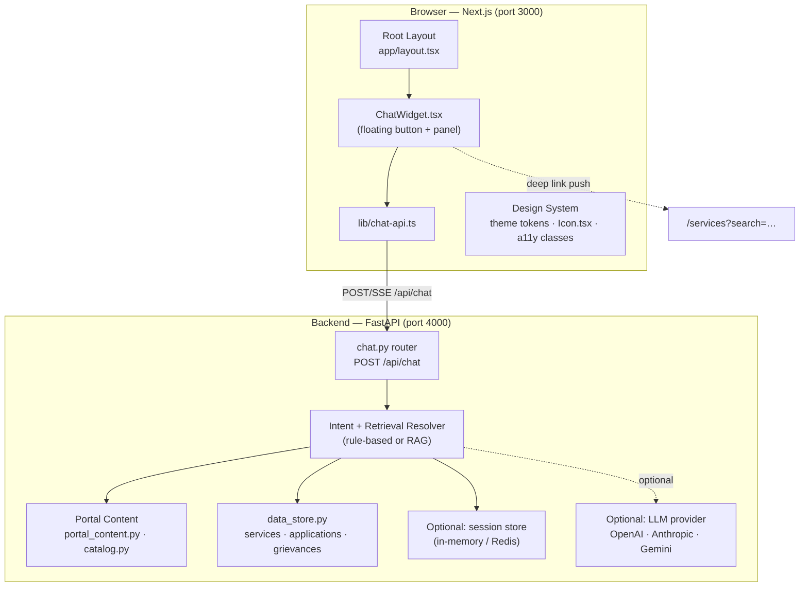
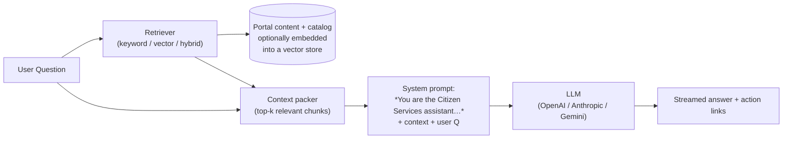
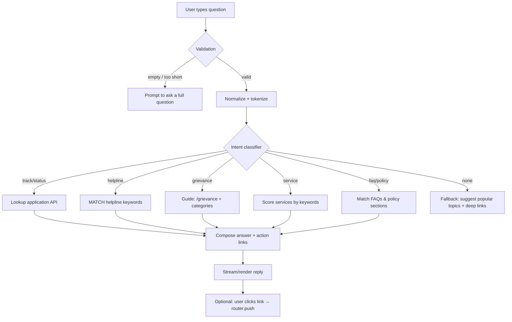
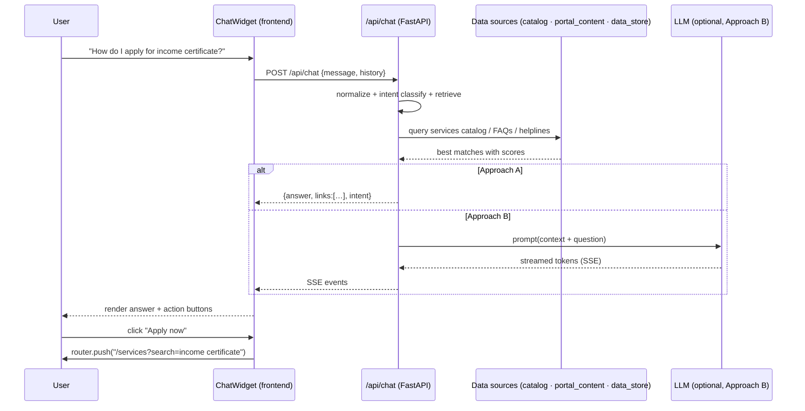
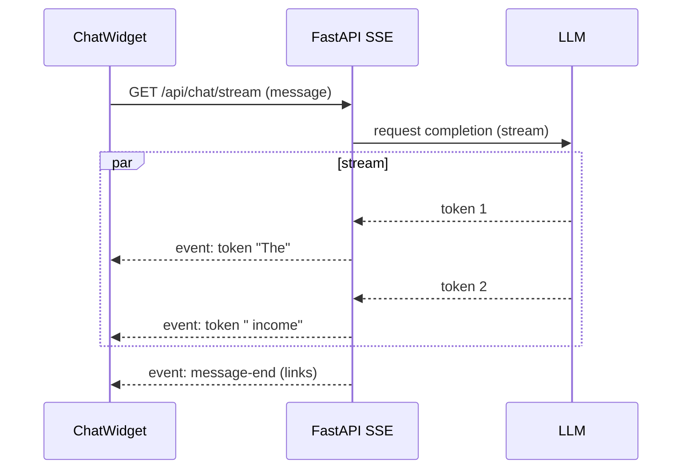

# Chatbot Assistant — Citizen Services Portal

## Table of Contents

1. [Overview](#overview)
2. [What It Does](#what-it-does)
3. [Architecture](#architecture)
4. [Data Sources in This Codebase](#data-sources-in-this-codebase)
5. [Approach A — Retrieval-Based (no LLM, offline demo)](#approach-a--retrieval-based-no-llm-offline-demo)
6. [Approach B — LLM-Powered RAG](#approach-b--llm-powered-rag)
7. [Approach C — LangChain / LangGraph + LLM API Keys (Gemini · OpenAI · Anthropic)](#approach-c--langchain--langgraph--llm-api-keys-gemini--openai--anthropic)
8. [Recommended Best Approach for This Project — Layered Hybrid](#recommended-best-approach-for-this-project--layered-hybrid)
9. [Backend Implementation](#backend-implementation)
10. [Frontend Implementation (widget in layout)](#frontend-implementation-widget-in-layout)
11. [Workflow Diagram](#workflow-diagram)
12. [Sequence Diagram](#sequence-diagram)
13. [Streaming (SSE) Design](#streaming-sse-design)
14. [Accessibility & Theming](#accessibility--theming)
15. [Security Considerations](#security-considerations)
16. [Step-by-Step Implementation Plan](#step-by-step-implementation-plan)
17. [Required Dependencies](#required-dependencies)

---

## Overview

A floating **chat assistant** widget, mounted once in the **root layout** so it is available on **every page**. Users ask questions in natural language about the portal — services, how to apply, tracking, helplines, FAQs, departments, grievances — and receive answers grounded in the portal's real data.

> Since this is a hackathon demo, the recommended path is **Approach A (retrieval-based)** first — it requires **zero API keys and zero extra cost**, works fully offline, and can be upgraded to Approach B (LLM) later by swapping the resolver.

---

## What It Does

| Capability | Example question | Source |
|---|---|---|
| Service lookup | "How do I get an income certificate?" | `SERVICES_CATALOG` (12 services) |
| Application status | "What is my application status?" | `GET /api/applications/track/{id}` or dashboard |
| FAQ answers | "What documents do I need?" | `FAQS`, `requiredDocuments` per service |
| Helpline lookup | "Emergency numbers?" / "Which number for cyber crime?" | `HELPLINES` (4 emergency + 12 other) |
| Portal navigation | "Where do I file a grievance?" | `DIRECTORY_NAV`, route map |
| Policies / legal | "What is your privacy policy?" | `POLICIES`, `PRIVACY_SECTIONS`, `TERMS_SECTIONS` |
| Grievance guidance | "How to complain about a delayed service?" | `GRIEVANCE_CATEGORIES` (7) + grievance flow |
| Deep-linking | "Show me education services" | `/services?category=education_skills` |

---

## Architecture



---

## Data Sources in This Codebase

Everything the assistant needs already exists. No new collections required.

### Backend (Python) — `backend/app/data/`
| File | Content | Count |
|---|---|---|
| `catalog.py` | `SERVICES_CATALOG` (name, slug, category, department, processingDays, requiredDocuments, onlineAvailable) | 12 |
| `portal_content.py` | `PORTAL_CONFIG`, `NOTICES`, `DIRECTORY_NAV`, `FOOTER_LINKS`, `HELPLINES`, `POLICIES`, `FAQS`, `PRIVACY_SECTIONS`, `TERMS_SECTIONS`, `GRIEVANCE_CATEGORIES` | 40+ items |
| `models.py` | Typed structures for all the above | — |

### Frontend (TypeScript) — `frontend/lib/`
- `types.ts` — mirrors the backend models (`Service`, `Application`, `Category`, `STATUS_LABELS`…)
- `portal-api.ts` — typed wrappers for all `/api/portal/*` endpoints
- `api.ts` / `auth-api.ts` — `apiFetch` for authenticated / public calls

---

## Approach A — Retrieval-Based (no LLM, offline demo)

A deterministic **intent classifier + keyword retriever**. No network calls, no API keys, instant response.

### Pipeline
1. **Normalize** the user message: lowercase, strip punctuation, Indian-English spelling variants (`aadhaar`/`aadhar`/`adhaar`, `birth cert` → `birth certificate`).
2. **Scoring**: tokenize the message and score each candidate (service / FAQ / helpline / policy / route) by matched keywords and weighted synonyms.
   ```python
   score = sum(weight for token in tokens if token in candidate.keywords)
   ```
3. **Intent routing** by keyword group:
   - `track|status|reference|ref id` → application tracking flow
   - `helpline|number|emergency|police|ambulance|fire` → helpline lookup
   - `grievance|complaint|complain` → grievance guidance
   - `apply|how to|documents|eligibility|fee` → service lookups
   - else → FAQ / policy / fallback
4. **Respond**: return the best match as structured text plus an optional **deep link** (`/services?...`, `/track`, `/grievance`).

### Why it fits this repo
- The FAQ list is tiny (4 items) and services small (12) — keyword search is 100% accurate and explainable.
- Costs nothing, runs without Internet, safe for a demo staged anywhere.

---

## Approach B — LLM-Powered RAG

Retrieval-Augmented Generation: inject retrieved portal context into an LLM prompt.



- Vector embeddings (e.g. `sentence-transformers/all-MiniLM-L6-v2`) for semantic search over service descriptions, FAQs and policies.
- Store vectors in memory (demo) or `Chromadb` / `FAISS`.
- Streaming via **SSE** (see [Streaming design](#streaming-sse-design)).
- Guardrails: system prompt instructs the model to only answer from provided context and to say "I don't know" otherwise.

---

## Approach C — LangChain / LangGraph + LLM API Keys (Gemini · OpenAI · Anthropic)

### C.1 The short answer

**Yes** — this assistant can absolutely be built with **LangChain**, or with a direct **LLM API key** (Gemini / OpenAI / Anthropic). A pure retrieval assistant (Approach A) needs no AI at all; the moment you want natural, varied answers you add an LLM. You have three integration families — **LangChain** (Python/JS framework), **LangGraph** (stateful agents), and the **Vercel AI SDK** (native to this Next.js frontend). All three are provider-agnostic — Gemini, OpenAI, and Anthropic work behind a one-line switch.

### C.2 What is LangChain?

- **What:** an open-source framework (Python and JavaScript/TypeScript) of composable building blocks for LLM apps — chat models, prompt templates, retrievers, vector stores, tools, output parsers, memory.
- **Provider-agnostic:** `ChatOpenAI`, `ChatAnthropic`, `ChatGoogleGenerativeAI` share the same `invoke()` / `stream()` / `bind_tools()` interface, so switching Gemini → OpenAI → Claude is a one-line change.
- **Best fit here:** the **Approach B RAG** path. LangChain gives you the retrieval pipeline (embed → store → query → pack context) with minimal glue code.
- **Gemini note (2026):** `langchain-google-genai` ≥ 4.x uses the consolidated `google-genai` SDK. `ChatGoogleGenerativeAI` and `GoogleGenerativeAIEmbeddings` connect to either the **Gemini Developer API** (just set `GOOGLE_API_KEY`) or **Vertex AI** (`project=...`, `vertexai=True`). Python ≥ 3.10 required.

### C.3 What is LangGraph?

- **What:** LangChain's engine for **stateful, multi-step agents**. The assistant is modelled as a graph — nodes are steps (retrieve → think → act → answer), edges are transitions, and cycles are allowed ("loop until a tool succeeds").
- **Key change:** the old `AgentExecutor` is **deprecated (EOL Dec 2026)**. Today you build agents with `create_react_agent()` (simple tool loop) or a custom `StateGraph`, with **durable state** via checkpointers (Postgres / Redis).
- **Best fit here:** only when the chatbot must **call backend tools** — e.g. `track_application(reference_id)` hitting `/api/applications/track/{id}`, or `lookup_helpline(kind)`. That's a later enhancement; the demo does not need cycles.

### C.4 What is an LLM API key?

An **API key** is your billing + identity credential for a hosted model. It lives **only in the backend** (`.env`), never in the frontend. "Using a Gemini/OpenAI/Anthropic key" just means pointing an SDK at that vendor's API.

| Provider | SDK | Key notes (2026) |
|---|---|---|
| **Gemini (Google)** | `google-genai` (Python/Node) or `langchain-google-genai` | **Free tier, no credit card** — ideal for a hackathon. Cost-efficient default: **Gemini 2.5 Flash**. **Prompt caching** (`CreateCachedContentConfig` + TTL) discounts cached input ~75% — great when the long system prompt + portal context repeats every call. First-class SSE streaming. |
| **OpenAI** | `openai` / `langchain-openai` | GPT models, strong tool-calling. No lasting free tier — per-token paid only. |
| **Anthropic (Claude)** | `anthropic` / `langchain-anthropic` | Excellent instruction-following and tool use. Paid per-token; small free credit for new accounts. |

### C.5 Tool comparison for this project

| | LangChain | LangGraph | Vercel AI SDK | Raw vendor SDK |
|---|---|---|---|---|
| Language | Python & JS | Python & JS | TypeScript (any UI) | per-vendor |
| Primary job | RAG pipelines, tool chains | stateful agents (cycles, checkpoints) | chat UI + streaming in Next.js | lowest-level calls |
| Streaming | ✅ `stream()` | ✅ | ✅ `streamText` / `useChat` | ✅ |
| RAG helpers | ✅ rich (retrievers, vectorstores) | ✅ via LangChain primitives | ✅ + `@ai-sdk/react` | 🟡 manual |
| Controls backend data | via Python service layer | via Python service layer | calls your API | via your API |
| Fits this repo | ✅ backend (port 4000) | later phase (tool agent) | ✅ frontend (Next.js) | ✅ minimal path |

### C.6 Which to choose

| If you want… | Use |
|---|---|
| **Recommended demo path** (free, data already in backend) | **FastAPI + LangChain + Gemini free tier** (Path A below) |
| A pure **frontend** build with zero Python AI code | **Vercel AI SDK** in a Next.js route handler (Path B below) |
| Later: a chatbot that **acts** on your data (track my application, file grievance) | add a **LangGraph** `create_react_agent()` exposing those tools |
| Vendor independence / swap-any-time | LangChain or AI SDK (both provider-agnostic) |

### C.7 Path A — Python backend: FastAPI + LangChain + Gemini

Wire `langchain-google-genai` into the existing `chat.py` router, with a small RAG layer over the portal data:

```bash
pip install langchain langchain-google-genai google-genai   # append to backend/requirements.txt
export GOOGLE_API_KEY=...        # or in backend/.env — NEVER in the frontend
```

```python
from langchain_google_genai import ChatGoogleGenerativeAI, GoogleGenerativeAIEmbeddings

llm = ChatGoogleGenerativeAI(model="gemini-2.5-flash", temperature=0.2)
embeddings = GoogleGenerativeAIEmbeddings(model="models/text-embedding-004")
```

Grounded answer chain (pseudo-code — embed the portal content once into `FAISS`/`Chromadb` at startup, then retrieve top-k):

```python
from langchain_core.prompts import ChatPromptTemplate

retriever = vector_store.as_retriever(search_kwargs={"k": 4})
prompt = ChatPromptTemplate.from_template(
    "You are the Citizen Services assistant. Answer ONLY from the context.\n"
    "Context:\n{context}\n\nQuestion: {input}"
)
rag = retriever | prompt | llm          # modern Runnable sequence
async for chunk in rag.astream({"input": user_message}):
    yield f"data: {json.dumps({'token': chunk.content})}"   # → SSE
```

For Gemini, wrap the static system + context prefix in a `CachedContent` to cut repeated-input cost ~75%.

### C.8 Path B — Next.js native: Vercel AI SDK

Keep all AI code in TypeScript and route chat through a Next.js API route so the key never reaches the browser:

```bash
npm install ai @ai-sdk/react @ai-sdk/google zod      # in frontend/
```

```ts
// frontend/app/api/chat/route.ts
import { streamText } from 'ai';
import { google } from '@ai-sdk/google';

export async function POST(req: Request) {
  const { messages } = await req.json();
  const system =
    'You are the Citizen Services assistant. Answer only from portal context. ' +
    'Cite sources when possible; say "I don't know" instead of guessing.';
  const result = streamText({ model: google('gemini-2.5-flash'), system, messages });
  return result.toDataStreamResponse();
}
```

```tsx
// ChatWidget.tsx — useChat handles streaming + message state
import { useChat } from '@ai-sdk/react';
const { messages, input, handleInputChange, handleSubmit } = useChat();
```

> Hybrid option: point `useChat({ url: 'http://localhost:4000/api/chat/stream' })` at the FastAPI SSE endpoint, so retrieval stays in Python while streaming UX comes from the AI SDK.

### C.9 Cost & free-tier notes

- The **Gemini free tier** is enough for a hackathon demo (RPM/token caps, no card required); **Gemini 2.5 Flash** keeps the whole demo essentially free.
- Keep retrieval cheap: 400–600 char chunks with ~10% overlap, embed once offline, prompt-cache the static prefix. Re-embed only when `catalog.py` / `portal_content.py` change.
- Never commit a key (`GOOGLE_API_KEY` etc.) — see the Firebase key warning in [Security Considerations](#security-considerations).

---

## Recommended Best Approach for This Project — Layered Hybrid

### D.1 The recommendation

Build a **two-layer assistant**: start with **Approach A (rule-based retrieval) as the always-on baseline**, and add **Approach C Path A (LangChain + Gemini free tier) as an upgrade layer** that activates only when an API key is present and falls back instantly when it isn't (or when the LLM errors/timeouts).

This is deliberately **not** "LangChain-only" or "rule-based-only". Each question is routed to whichever resolver is *safest and cheapest*:

```mermaid
flowchart TD
    Q["User question"] --> N["normalize + tokenize"]
    N --> R{"high-confidence<br/>intent?"}
    R -- track/status --> A["Deterministic rule resolver<br/>(Approach A) — fast, free, exact"]
    R -- helpline/emergency --> A
    R -- grievance walkthrough --> A
    R -- service/FAQ "simple" --> A
    R -- open-ended / no clear intent --> RD{"GOOGLE_API_KEY present<br/>and backend up?"}
    RD -- yes --> B["LangChain RAG chain<br/>(Gemini 2.5 Flash, top-k context)"]
    RD -- no / LLM error / timeout > 2s --> F["Fallback: Approach A<br/>+ suggest popular topics + links"]
    B -- streamed answer --> OUT["Same envelope always:<br/>{answer, intent, matches?, links?}"]
    A --> OUT
    F --> OUT
    OUT --> W["ChatWidget renders — frontend never changes"]
```

### D.2 Why this is the best fit for this project

- **Data lives in the backend (Python).** `catalog.py`, `portal_content.py`, `data_store.py` are already imported server-side, so LangChain in FastAPI retrieves them with **zero extra network hops** — no cross-language proxy needed.
- **Zero-cost guarantee.** With no key set, the demo is 100% Approach A: free, offline-safe, and works on any stage. With a Gemini key, only the questions that *need* an LLM pay tokens (Flash ≈ free).
- **Deterministic for the demo's critical flows.** "Track my application" and "emergency helplines" must be exact — routing them to the rule resolver keeps them accurate and explainable instead of hallucination-prone.
- **Same wire contract.** Every resolver returns `{ answer, intent, matches?, links? }`, so the already-designed `ChatWidget.tsx` + `chat-api.ts` ship unchanged; swapping resolvers never touches the UI.
- **SSE ready.** LangChain's `Runnable.astream()` feeds the existing [Streaming (SSE)](#streaming-sse-design) design token-by-token.
- **Upgrade path.** If a hackathon judge asks for an agent that *acts*, add a **LangGraph** `create_react_agent()` exposing tools (`track_application`, `file_grievance_guide`) — it reuses the same retrieval layer.

### D.3 What to implement, in order

| Phase | Scope | Resolver | Effort |
|---|---|---|---|
| **Phase 1 (ship first)** | `POST /api/chat` + ChatWidget + deep links | Approach A rule-based | ~half a day |
| **Phase 2 (free upgrade)** | LangChain RAG chain + Gemini free tier + auto-fallback + streaming | Hybrid (A ⇒ C) | ~a day |
| **Phase 3 (optional wow)** | LangGraph agent: track/file-grievance tool calls, session store | Hybrid (A ⇒ C ⇒ agent) | if time permits |

### D.4 Guardrails for the hybrid

- Classify **first**, call LLM **only when needed** — this keeps latency low and the free tier comfortably within limits.
- Tighten rate limiting on `/api/chat` to ~30 req/min/IP *only for the LLM branch* (the rule branch is cheap).
- The LLM branch **never** answers status/grievance specifics from memory — those go to real APIs via the rule branch or an agent tool.
- Keep **keys in backend `.env` only**; frontend sees `NEXT_PUBLIC_API_URL` and nothing else.

---

## Backend Implementation

New file: `backend/app/routers/chat.py`, registered in `main.py` like the other routers.

```python
# backend/app/routers/chat.py
from fastapi import APIRouter
from pydantic import BaseModel
from app.data.catalog import SERVICES_CATALOG
from app.data.portal_content import FAQS, HELPLINES, POLICIES

router = APIRouter()

class ChatMessage(BaseModel):
    message: str
    history: list[dict] = []   # optional, for multi-turn

class ChatReply(BaseModel):
    answer: str
    intent: str
    matches: list[str] | None = None
    links: list[dict] | None = None

@router.post("", response_model=ChatReply)
async def chat(msg: ChatMessage):
    return resolve_chat(msg)   # retrieve + respond (Approach A)
```

Register: add `chat` to the router import list in `app/main.py` and call `app.include_router(chat.router, prefix="/api/chat", tags=["chat"])`.

> **Do not** send raw user input into an LLM prompt without sanitising; keep the resolver additive (intent + retrieval) so it degrades gracefully.

---

## Frontend Implementation (widget in layout)

### Component: `frontend/components/ChatWidget.tsx` (`'use client'`)

- **Floating button** bottom-right (above the cookie consent bar), a circular `gradient-primary` chip with a `support_agent` icon (already mapped in `Icon.tsx`).
- **Panel** (framer-motion `AnimatePresence` like the a11y dropdown): header with avatar + "Citizen Services Assistant", scrollable message list, quick-suggestion chips ("How to apply for income certificate?", "Emergency helplines", "Track my application"), input + send button.
- **Message model**: `{ role: 'user' | 'assistant', text, links?: [{label, href}] }`.
- **Rendering links**: show returned deep links as buttons that call `router.push(href)` — keeps the user inside the portal.
- **Persist** last N messages in `sessionStorage['chat-log']` (session-scoped, no PII).

### API client: `frontend/lib/chat-api.ts`
```ts
import { API_URL } from '@/lib/api';

export interface ChatReply { answer: string; intent: string; matches?: string[]; links?: {label: string; href: string}[] }

export async function askAssistant(message: string, history: ChatReply[] = []): Promise<ChatReply> {
  const res = await fetch(`${API_URL}/api/chat`, {
    method: 'POST',
    headers: { 'Content-Type': 'application/json' },
    body: JSON.stringify({ message, history }),
  });
  const json = await res.json();
  if (!res.ok || !json.success) throw new Error(json.error ?? 'Request failed');
  return json.data;
}
```

### Mounting — add to `frontend/app/layout.tsx`
```tsx
<Providers>
  <SmoothScrollProvider>
    <PrototypeBanner />
    <PortalChrome>{children}</PortalChrome>
    <Footer />
    <ChatWidget />        {/* ← rendered on every page */}
    <CookieConsent />
  </SmoothScrollProvider>
</Providers>
```
The widget floats and is `position: fixed`, so it works with the sticky header and any route.

---

## Workflow Diagram



---

## Sequence Diagram



---

## Streaming (SSE) Design

For Approach B, stream tokens so the UI feels responsive.

| Item | Detail |
|---|---|
| Endpoint | `GET /api/chat/stream?message=…` (or POST with SSE) |
| Media type | `text/event-stream` |
| Events | `message-start` → `token` (delta) → `message-end` (final + links) → `error` |
| Frontend | `EventSource` or `fetch` + `ReadableStream` reader |
| CORS | Already `allow_headers=["*"]`; Add `allowed_methods` if needed |



---

## Accessibility & Theming

- Use existing design tokens: `btn-primary`, `gradient-primary`, `bg-surface`, `text-on-surface`, `shadow-elevated`.
- Widget must respect the `.a11y-dark-mode` CSS invert (it will naturally, since it's in the page tree); test contrast.
- `min-h-[44px]` on send button, `aria-label` on the toggle, keyboard focus ring — note `globals.css` disables `:focus-visible`, so add an explicit `outline` on the widget or rely on the a11y "High Contrast" toggle.
- Honor `.a11y-reduce-motion` — the widget's animations use framer-motion which respects `prefers-reduced-motion` via `useReducedMotion()`.
- Move-to-message: scroll the message list to bottom on new message (`ref.current.scrollTop = scrollHeight`).

---

## Security Considerations

1. **Sanitise input** server-side: max length (e.g. 500 chars), strip control chars, trim.
2. **No PII**: don't send `demo-user` identity to chat context; keep chat stateless unless authenticated *and* the user explicitly asks about their own application (then use Bearer header like `authApiFetch`).
3. **Deep links only to public pages**: never generate arbitrary `href` from the LLM — whitelist route prefixes (`/services`, `/track`, `/grievance`, `/departments`, `/help`, `/policies`, …).
4. **Rate limiting**: `/api/chat` inherits the existing 300 req/min middleware; tighten to ~30 req/min per IP if an LLM is attached (cost).
5. **LLM key handling**: store API keys in backend environment only (`.env`), never in the frontend.
6. **⚠️ Repo hygiene**: a Firebase Admin private key exists at `frontend/vsrn2-bb230-firebase-adminsdk-fbsvc-9c55a0bfa3.json` — remove it from the repo and revoke it in the Firebase console before deploying anything.

---

## Step-by-Step Implementation Plan

| # | Task | Files | Depends on |
|---|------|-------|-----------|
| 1 | Create `chat.py` resolver (Approach A) + register router | `backend/app/routers/chat.py`, `backend/app/main.py` | — |
| 2 | Test with curl: `POST /api/chat {"message":"How do I get an income certificate?"}` | — | 1 |
| 3 | Build `ChatWidget.tsx` + `lib/chat-api.ts` | `frontend/components/ChatWidget.tsx`, `frontend/lib/chat-api.ts` | 2 |
| 4 | Mount widget in `layout.tsx` | `frontend/app/layout.tsx` | 3 |
| 5 | Add quick-suggestion chips + deep-link rendering | `ChatWidget.tsx` | 4 |
| 6 | (Optional) Add embeddings + vector retriever | `backend/app/services/rag.py` | 5 |
| 7 | (Optional) Add LLM provider + SSE stream endpoint | `backend/app/routers/chat.py` | 5 |
| 8 | Accessibility pass + dark-mode test | `ChatWidget.tsx`, `globals.css` | 5–7 |

---

## Required Dependencies

### Approach A (recommended first)
- **Backend:** none new (standard library + existing FastAPI).
- **Frontend:** none new (framer-motion, lucide-react, clsx already installed).

### Approach B
| Package | Why |
|---|---|
| `openai` / `anthropic` / `google-genai` | LLM provider SDK (pick one) |
| `sse-starlette` (or FastAPI StreamingResponse) | SSE streaming endpoint |
| `sentence-transformers` + `faiss-cpu` (or `chromadb`) | Embeddings + vector retrieval |
| (Frontend) none | use `fetch` ReadableStream |

### Recommended (Layered Hybrid — Phase 2)
| Package | Why |
|---|---|
| `langchain` (Python) | RAG pipeline: retriever → prompt → LLM runnable sequence |
| `langchain-google-genai` (+ `google-genai`) | `ChatGoogleGenerativeAI` (Gemini 2.5 Flash) + `GoogleGenerativeAIEmbeddings`; ≥ 4.x uses consolidated `google-genai` SDK |
| `faiss-cpu` or `chromadb` | In-memory vector store over portal content |
| `GOOGLE_API_KEY` in `backend/.env` | Gemini free-tier credential (backend only) |
| (Frontend) none new | ChatWidget uses the existing `chat-api.ts` contract |

**Alt: pure-frontend path (Path B)** — `ai`, `@ai-sdk/react`, `@ai-sdk/google`, `zod` in `frontend/`, key in `NEXT_PUBLIC_*`? **No** — key stays server-side in `frontend/app/api/chat/route.ts`.

**LangGraph (Phase 3, optional)** — `langgraph` package for `create_react_agent()` tools over `track_application` / `file_grievance_guide`, with `Postgres`/`Redis` checkpoints.

---

*Next:* see [MCP Server — Citizen Services Portal](./mcp-server.md) to expose the same data to external AI assistants.