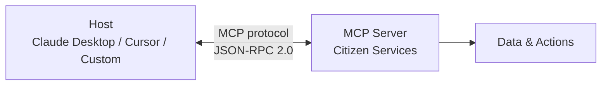
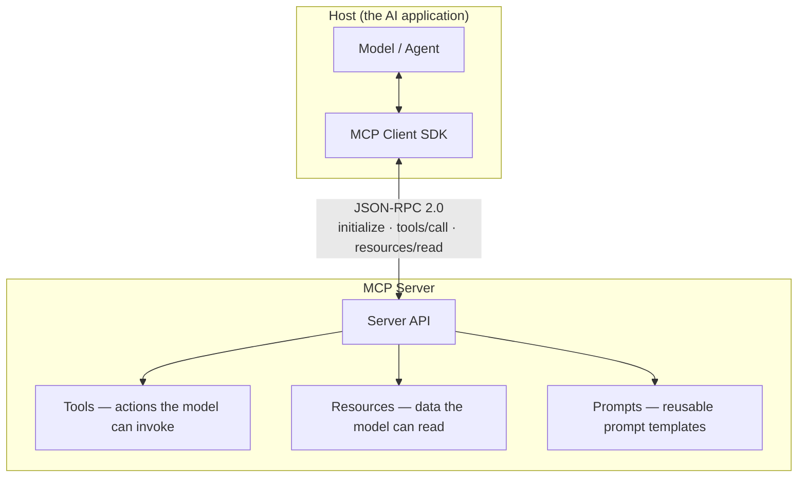
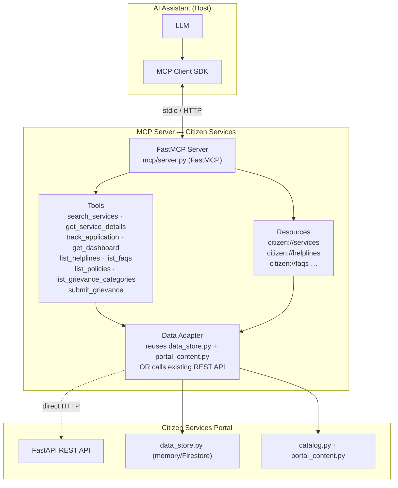
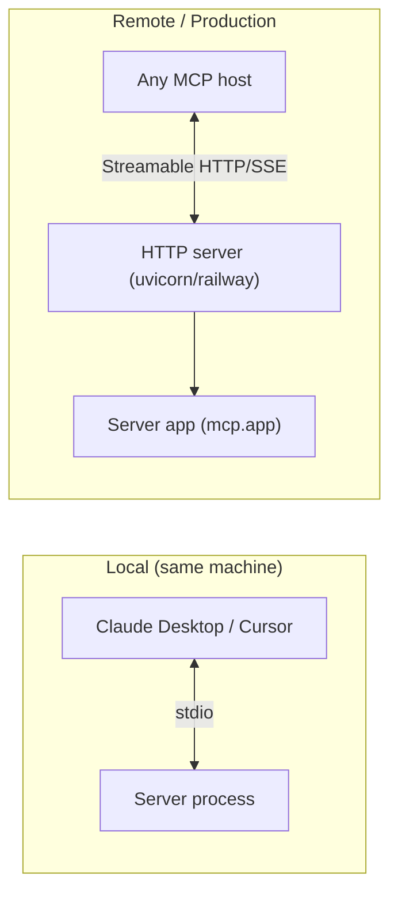
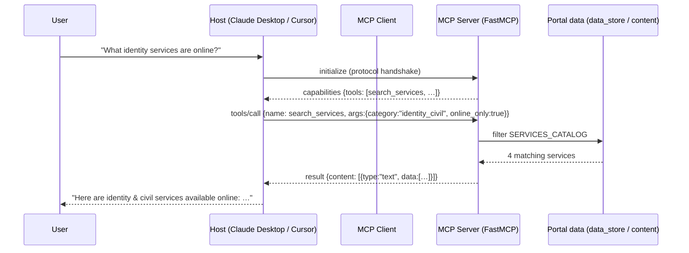
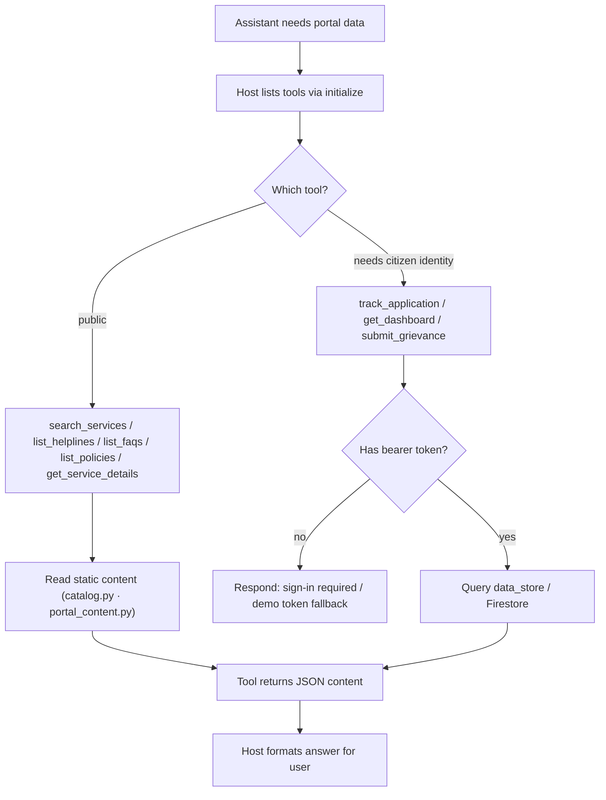
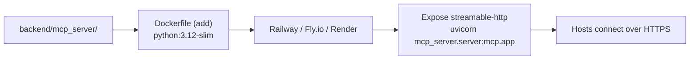

# MCP Server — Citizen Services Portal

## Table of Contents

1. [What is MCP?](#what-is-mcp)
2. [Why MCP for this Project](#why-mcp-for-this-project)
3. [Core MCP Concepts](#core-mcp-concepts)
4. [MCP Architecture](#mcp-architecture)
5. [Tools We Will Expose](#tools-we-will-expose)
6. [Implementation (Python SDK / FastMCP)](#implementation-python-sdk--fastmcp)
7. [Transports](#transports)
8. [Client Configuration](#client-configuration)
9. [Sequence Diagram](#sequence-diagram)
10. [Workflow Diagram](#workflow-diagram)
11. [Integration Options](#integration-options)
12. [Security Considerations](#security-considerations)
13. [Deployment](#deployment)
14. [Step-by-Step Implementation Plan](#step-by-step-implementation-plan)
15. [Required Dependencies](#required-dependencies)

---

## What is MCP?

**MCP — Model Context Protocol** — is an open standard (introduced by Anthropic, now governed under the Model Context Protocol umbrella) that defines how an **AI assistant** ("host") connects to **external tools and data** ("servers") through a uniform protocol.

Think of it as **"USB-C for AI tools"**: instead of every assistant writing bespoke integrations, a server exposes capabilities once, and any MCP-compatible host (Claude Desktop, Cursor, VS Code, JetBrains, custom apps) can use them.



**Key facts**
- Uses **JSON-RPC 2.0** over **stdin/stdout (stdio)** or **Streamable HTTP / SSE**.
- Servers advertise **Tools**, **Resources**, and **Prompts**.
- The host handles the model; the server supplies context and actions. **The LLM never calls your code directly** — it asks the host to invoke a tool, and the server executes it.
- Local-first: stdio servers run on the user's machine; remote servers are reachable via HTTP.

---

## Why MCP for this Project

The portal already exists as a REST API. MCP makes that data **usable by any AI assistant** with zero per-app integration:

| Use case | What the assistant can now do |
|---|---|
| "Find identity services that are available online" | calls `search_services` tool |
| "Track reference INC-2026-0001" | calls `track_application` tool |
| "What's the helpline for cyber crime?" | calls `list_helplines` tool |
| "Draft a grievance about a delayed certificate" | calls `get_grievance_categories` + `submit_grievance` |
| "Explain our privacy policy to me" | reads `privacy` resource |

It also future-proofs the hackathon: **demo-ability** (demo user can query live portal data), and **composable** — the same server can be plugged into multiple hosts.

---

## Core MCP Concepts



| Concept | Definition | In our server |
|---|---|---|
| **Tool** | A named, typed function the host can call | `search_services`, `track_application`, … |
| **Resource** | Exposed data identified by a `uri://` | `citizen://services`, `citizen://faqs`, … |
| **Prompt** | Reusable prompt template | `citizen/billing-assist` style helpers |
| **Transport** | How host ↔ server communicate | `stdio` (local) or `streamable-http` |

---

## MCP Architecture



Two clean integration strategies exist — see [Integration Options](#integration-options).

---

## Tools We Will Expose

Mapped directly from the existing backend capabilities:

| Tool name | Description | Wraps | Auth |
|---|---|---|---|
| `search_services` | Query services by category/name/online-only | `data_store.list_services` / `GET /api/services` | No |
| `get_service_details` | Full details of one service (docs, processing time) | `GET /api/services/{slug}` | No |
| `list_helplines` | Emergency + other helpline numbers | `HELPLINES` / `GET /api/portal/helplines` | No |
| `list_faqs` | Frequently asked questions | `FAQS` / `GET /api/portal/faqs` | No |
| `list_policies` | Portal policies | `POLICIES` / `GET /api/portal/policies` | No |
| `list_grievance_categories` | Categories for grievance filing | `GRIEVANCE_CATEGORIES` | No |
| `track_application` | Status of an application by ref ID | `data_store.get_application` / `GET /api/applications/track/{id}` | Bearer / demo |
| `get_dashboard` | Citizen overview (apps, notifications, drafts, unread) | `data_store.get_dashboard` / `GET /api/dashboard` | Bearer / demo |
| `submit_grievance` | File a grievance | `services/grievances.py` / `POST /api/grievances` | Bearer / demo |

---

## Implementation (Python SDK / FastMCP)

The backend is **Python + FastAPI**, so the Python SDK is the natural choice. `mcp[cli]` includes **FastMCP** — a thin, developer-friendly API.

### 1. Create the server — `backend/mcp_server/server.py`

```python
from mcp.server.fastmcp import FastMCP
from app.data.catalog import SERVICES_CATALOG
from app.data.portal_content import FAQS, HELPLINES, POLICIES

mcp = FastMCP("Citizen Services Portal")

@mcp.tool()
def search_services(category: str | None = None, online_only: bool = False, query: str | None = None) -> list[dict]:
    """Search the citizen services catalog."""
    items = SERVICES_CATALOG
    if category:
        items = [s for s in items if s["category"] == category]
    if online_only:
        items = [s for s in items if s["onlineAvailable"]]
    if query:
        q = query.lower()
        items = [s for s in items if q in s["name"].lower() or q in s["description"].lower()]
    return items

@mcp.tool()
def list_helplines(emergency_only: bool = False) -> dict:
    """List government helpline numbers (optionally only emergencies)."""
    return {"emergency": HELPLINES["emergency"]} if emergency_only else HELPLINES

@mcp.resource("citizen://faqs")
def faqs_resource() -> list[dict]:
    """Portal frequently asked questions."""
    return FAQS
```

### 2. Run it (stdio — used by desktop hosts)
```bash
cd backend && python -m mcp_server.server --transport stdio
```

### 3. Run it as Streamable HTTP (remote)
```bash
# uvicorn entry that mounts the FastMCP app (it exposes an ASGI app)
cd backend && uvicorn mcp_server.server:mcp.app --port 5000
```

> Validate locally first with the **MCP Inspector**:
> ```bash
> mcp dev backend/mcp_server/server.py
> ```

---

## Transports



| Transport | When to use | Notes |
|---|---|---|
| **stdio** | Local dev, Claude Desktop, Cursor | Simplest; keep process-alive with `--stdio`; no CORS/ports. |
| **Streamable HTTP** | Hosted server accessed from anywhere | Need CORS + auth (see Security). |
| SSE | Legacy HTTP servers | Older alternative; FastMCP prefers streamable-http now. |

---

## Client Configuration

### Claude Desktop — `claude_desktop_config.json`
```json
{
  "mcpServers": {
    "citizen-services": {
      "command": "python",
      "args": ["-m", "mcp_server.server", "--transport", "stdio"],
      "cwd": "C:/Charan/My Projects/Hackathon/Vsrun-Mayya/backend"
    }
  }
}
```

### Cursor (`.cursor/mcp.json`)
```json
{
  "mcpServers": {
    "citizen-services": {
      "command": "python",
      "args": ["-m", "mcp_server.server", "--transport", "stdio"],
      "cwd": "C:/Charan/My Projects/Hackathon/Vsrun-Mayya/backend"
    }
  }
}
```

### VS Code (user settings → `mcp.json` / registered server)
Similar shape: command `python`, args `-m mcp_server.server`, transport stdio.

### Custom JS host (if you later want the MCP client *inside* the portal frontend)
```ts
// uses @modelcontextprotocol/sdk client — connects to streamable-http
const client = new Client({ name: "citizen-client", version: "1.0.0" });
await client.connect(new StreamableHTTPClientTransport("http://localhost:5000/mcp"));
```

---

## Sequence Diagram



---

## Workflow Diagram



---

## Integration Options

### Option 1 — Reuse backend services directly (recommended)
The MCP server lives **inside** `backend/` and imports the same modules:
```python
from app.services.data_store import data_store
from app.data.catalog import SERVICES_CATALOG
```
**Pros:** single source of truth, no HTTP hop, works offline, zero latency.  
**Cons:** cannot run as a separate deployed service without sharing the codebase.

### Option 2 — MCP server calls the running REST API
The MCP server `httpx`-calls `http://localhost:4000/api/...` and reuses the existing auth + middleware.
**Pros:** clean separation; MCP server can be deployed anywhere.  
**Cons:** extra network hop; must replicate auth headers; two places to keep in sync.

> Recommendation: **Option 1** for the hackathon (fast + consistent), same as the chatbot's data adapter.

---

## Security Considerations

1. **Protected tools need a token**: `track_application`, `get_dashboard`, `submit_grievance` operate per-citizen. Pass `Authorization: Bearer <uid>` (or the `citizen-services-auth` cookie) from the host config / a wrapper layer. Reuse `dependencies.get_current_user` semantics.
2. **Scope by design**: expose read-mostly tools; mark mutations (`submit_grievance`) prominently so hosts ask for confirmation.
3. **Input validation**: use Pydantic-style typed params in tool signatures; enforce max-length on strings; coerce enums (`category`, `ApplicationStatus`).
4. **No secrets in server**: the MCP server must never expose `FIREBASE_SERVICE_ACCOUNT_JSON` to the model.
5. **Rate limit remote transport**: apply the same 300/min middleware pattern (or an `n`-specific limit) when exposing over HTTP.
6. **⚠️ Same repo secret issue applies**: remove `frontend/vsrn2-bb230-firebase-adminsdk-fbsvc-9c55a0bfa3.json` before publishing anything.

---

## Deployment



- Add the MCP server package to `backend/requirements.txt`: `mcp[cli]`.
- Optional separate `Dockerfile.mcp` so the MCP transport can scale independently of the REST API.
- Set `StreamableHTTP` behind TLS; add CORS for known hosts only.

---

## Step-by-Step Implementation Plan

| # | Task | Files | Depends on |
|---|------|-------|-----------|
| 1 | Add `mcp[cli]` to requirements | `backend/requirements.txt` | — |
| 2 | Create FastMCP server with read-only tools first | `backend/mcp_server/server.py`, `backend/mcp_server/__init__.py` | 1 |
| 3 | Test with MCP Inspector / Claude Desktop | `claude_desktop_config.json` | 2 |
| 4 | Add resources (`citizen://faqs`, `citizen://helplines`, `citizen://policies`) | `server.py` | 3 |
| 5 | Add protected tools (`track_application`, `get_dashboard`, `submit_grievance`) | `server.py` + auth adapter | 4 |
| 6 | Switch to Streamable HTTP + CORS | `server.py` entry for uvicorn | 5 |
| 7 | Write `.cursor/mcp.json` + VS Code config + doc pointer | repo | 6 |

---

## Required Dependencies

| Package | Purpose |
|---|---|
| `mcp[cli]` | FastMCP + SDK (tools/resources/prompts, stdio + http transports) |
| `uvicorn` | already present — ASGI host for streamable-http |
| `httpx` (Option 2 only) | call the REST API from the MCP server |
| `pydantic` | already present — tool arg validation |

No frontend dependencies needed (unless you embed an MCP client — then `@modelcontextprotocol/sdk`).

---

*Next:* see [Chatbot Assistant — Citizen Services Portal](./chatbot-assistant.md) for the in-site query assistant that consumes the same data sources.